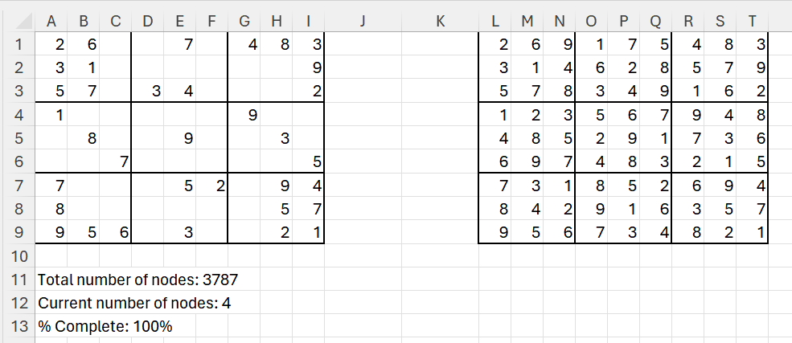

# ExcelSudokuSolver
Sudoku solver using Visual Basic for Applications (VBA) macro that can run in Excel.  
Uses a branch & bound depth-first algorithm.  
Screenshot below: original Puzzle to the left, solved puzzle to the right.  Stats for nerds at the bottom!

